# 第3組

組員:<br>
41043218陳荔群 [自我介紹](https://github.com/jayforedu/DBMS-homework/blob/main/%E8%87%AA%E6%88%91%E4%BB%8B%E7%B4%B9/%E9%99%B3%E8%8D%94%E7%BE%A4.md)<br>
41043220曾聖傑 [自我介紹](https://github.com/jayforedu/DBMS-homework/blob/main/%E8%87%AA%E6%88%91%E4%BB%8B%E7%B4%B9/%E6%9B%BE%E8%81%96%E5%82%91.md)<br>
41043255蘇于驊 [自我介紹](https://github.com/jayforedu/DBMS-homework/blob/main/%E8%87%AA%E6%88%91%E4%BB%8B%E7%B4%B9/%E8%98%87%E4%BA%8E%E9%A9%8A.md)<br>
41048110梁詠琳 [自我介紹](https://github.com/jayforedu/DBMS-homework/blob/main/%E8%87%AA%E6%88%91%E4%BB%8B%E7%B4%B9/%E6%A2%81%E8%A9%A0%E7%90%B3.md)

# [完整報告連結](https://docs.google.com/document/d/18K9Urzg_hpc5BT1ZAGIT-bQqj3oyajBH6KNKCSgzMGU/edit?tab=t.0)

# 題目: 電商平台資料庫設計

---
目錄
===
[一、應用情境與使用案例](https://github.com/jayforedu/DBMS-homework?tab=readme-ov-file#%E4%B8%80%E6%87%89%E7%94%A8%E6%83%85%E5%A2%83%E8%88%87%E4%BD%BF%E7%94%A8%E6%A1%88%E4%BE%8Buse-case)<br>
[二、系統需求說明](https://github.com/jayforedu/DBMS-homework?tab=readme-ov-file#%E4%BA%8C%E7%B3%BB%E7%B5%B1%E9%9C%80%E6%B1%82%E8%AA%AA%E6%98%8E)<br>
[三、完整性限制（Integrity Constraints）](https://github.com/jayforedu/DBMS-homework?tab=readme-ov-file#%E4%B8%89%E5%AE%8C%E6%95%B4%E6%80%A7%E9%99%90%E5%88%B6integrity-constraints)<br>
[四、ER Diagram（實體關係圖）](https://github.com/jayforedu/DBMS-homework?tab=readme-ov-file#%E5%9B%9Ber-diagram%E5%AF%A6%E9%AB%94%E9%97%9C%E4%BF%82%E5%9C%96)<br>
[五、ER Diagram 詳細說明（實體與關係）](https://github.com/jayforedu/DBMS-homework?tab=readme-ov-file#%E4%BA%94er-diagram-%E8%A9%B3%E7%B4%B0%E8%AA%AA%E6%98%8E%E5%AF%A6%E9%AB%94%E8%88%87%E9%97%9C%E4%BF%82)<br>
[六、Schema2SQL](https://github.com/jayforedu/DBMS-homework/tree/main#%E5%85%ADschema2sql)<br>
[七、實作結果](https://github.com/jayforedu/DBMS-homework/tree/main#%E4%B8%83%E5%AF%A6%E4%BD%9C%E7%B5%90%E6%9E%9C)<br>
[八、view實作](https://github.com/jayforedu/DBMS-homework/tree/main#%E5%85%ABview%E5%AF%A6%E4%BD%9C)<br>
[九、團隊分工](https://github.com/jayforedu/DBMS-homework/tree/main#%E4%B9%9D%E5%9C%98%E9%9A%8A%E5%88%86%E5%B7%A5)<br>
[十、參考資料](https://github.com/jayforedu/DBMS-homework/tree/main?tab=readme-ov-file#%E5%8D%81%E5%8F%83%E8%80%83%E8%B3%87%E6%96%99)

## 一、應用情境與使用案例（Use Case）

**本專題皆有使用ChatGPT輔助**

### 🔹 應用情境說明
本系統模擬一個電商平台（如蝦皮），讓賣家能夠上架商品、管理訂單，買家能夠註冊帳號、瀏覽商品、下訂單與付款，並提供評價功能。系統亦包含後台管理員可監控整體平台狀況。

### 🔹 使用者角色
- 買家（Customer）  
- 賣家（Seller）  
- 管理員（Admin）

### 🔹 主要使用案例 Use Cases

| 使用者角色 | 使用案例 |
|------------|-----------|
| 買家       | 註冊/登入、瀏覽商品、加入購物車、下單、付款、查看訂單、評價商品 |
| 賣家       | 註冊/登入、上架商品、修改商品資訊、查看訂單、出貨、查看評論 |
| 管理員     | 查看平台交易記錄、管理用戶帳號、下架不當商品 |

---

## 二、系統需求說明

### Customer（買家）
| 欄位名稱           | 完整性限制說明                                                                                       |
| -------------- | --------------------------------------------------------------------------------------------- |
| `customer_id`  | 主鍵，唯一且不可為空。系統自動生成或由系統驗證唯一性。                                                                   |
| `name`         | 僅可包含英文大小寫與數字（A-Z, a-z, 0-9），不得有空格或特殊字元，長度 3–20 字元。正規表示式：`^[A-Za-z0-9]{3,20}$`。                |
| `email`        | 唯一且不可為空，需符合有效 Email 格式，例如 `user@example.com`，不可含空格。可使用正規表示式 `^[\w\.-]+@[\w\.-]+\.\w{2,}$` 驗證。 |
| `phone_number` | 不可為空。必須為 10 位數字且開頭為 `09`。正規表示式：`^09\d{8}$`。                                                   |
| `gender`       | 不可為空。僅允許「男」、「女」、「其他」三種值。建議使用 ENUM 或 CHECK 限制。                                                 |
| `birthdate`    | 不可為空。格式須為 `YYYY-MM-DD`。必須為有效歷史日期，不得晚於系統當前日期。                                                  |


### Seller（賣家）
| 欄位名稱           | 完整性限制說明                                                  |
| -------------- | -------------------------------------------------------- |
| `seller_id`    | 主鍵，唯一且不可為空。系統自動生成或由系統驗證唯一性。                              |
| `name`         | 限制同 `Customer.name`。                                     |
| `email`        | 限制同 `Customer.email`，且必須在 `Customer.email` 中保持唯一性（跨表唯一）。 |
| `phone_number` | 限制同 `Customer.phone_number`。                             |
| `gender`       | 限制同 `Customer.gender`。                                   |
| `birthdate`    | 限制同 `Customer.birthdate`。                                |


### Admin（管理員）
| 欄位名稱       | 完整性限制說明                                                                               |
| ---------- | ------------------------------------------------------------------------------------- |
| `admin_id` | 主鍵，唯一且不可為空。                                                                           |
| `username` | 唯一且不可為空，僅可使用英數字（A-Z, a-z, 0-9），長度建議為 4–20 字元。不得包含空白或特殊字元。正則式可為 `^[A-Za-z0-9]{4,20}$`。 |


### Product（商品）
| 欄位名稱         | 完整性限制說明                                               |
| ------------ | ----------------------------------------------------- |
| `product_id` | 主鍵，唯一且不可為空。                                           |
| `name`       | 不可為空，應具明確辨識意義，避免重複，建議使用唯一索引輔助搜尋。                      |
| `price`      | 必須為正數，> 0，允許最多兩位小數。建議使用 `DECIMAL(10,2)` 並加上 CHECK 條件。 |
| `stock`      | 必須為 0 或正整數，建議使用 `CHECK (stock >= 0)`。                 |
| `category`   | 可為空，若填寫應屬於定義好的類別（例如 ENUM 或參照分類表），避免自由輸入造成資料混亂。        |
| `seller_id`  | 外鍵，參照 `Seller.seller_id`，不可為空。必須對應現有賣家。違反時應拒絕寫入。      |


### Order（訂單）
| 欄位名稱          | 完整性限制說明                                                |
| ------------- | ------------------------------------------------------ |
| `order_id`    | 主鍵，唯一且不可為空。                                            |
| `order_date`  | 不可為空，格式為 `YYYY-MM-DD`，不得早於系統啟用日或晚於系統當前時間。              |
| `status`      | 不可為空，限定值：「未付款」、「處理中」、「已出貨」、「已完成」。建議使用 ENUM 或 CHECK 實作。 |
| `customer_id` | 外鍵，參照 `Customer.customer_id`，不可為空。                     |


### OrderItem（訂單項目）
| 欄位名稱                     | 完整性限制說明                                     |
| ------------------------ | ------------------------------------------- |
| `order_id`               | 外鍵，參照 `Order.order_id`，不可為空。                |
| `product_id`             | 外鍵，參照 `Product.product_id`，不可為空。            |
| `(order_id, product_id)` | 複合主鍵，需唯一且不可為空，確保同一訂單中不會重複記錄相同商品。            |
| `quantity`               | 必須為正整數，且不可為 0 或負值，應小於等於商品當下庫存。建議加上邏輯驗證。     |
| `price_at_purchase`      | 必須為正數，紀錄下單當時的價格，不能為 0 或負數。與當前價格分開儲存以保留歷史紀錄。 |


### Review（商品評價）
| 欄位名稱          | 完整性限制說明                                           |
| ------------- | ------------------------------------------------- |
| `review_id`   | 主鍵，唯一且不可為空。                                       |
| `product_id`  | 外鍵，參照 `Product.product_id`，不可為空。                  |
| `customer_id` | 外鍵，參照 `Customer.customer_id`，不可為空。                |
| `rating`      | 整數，限制為 1 至 5，使用 CHECK (rating BETWEEN 1 AND 5)。   |
| `comment`     | 可為空，但若填寫，內容不可為空白或無意義字元。建議以正規表示式排除純空白。             |
| `review_date` | 不可為空。格式為 `YYYY-MM-DD`，不得晚於系統當前時間，亦不得早於該筆商品訂單完成時間。 |


---

## 三、完整性限制（Integrity Constraints）

| 類別                                       | 詳細說明                                                                                                                                                                                                                                                                                                                                                 |
| ---------------------------------------- | ---------------------------------------------------------------------------------------------------------------------------------------------------------------------------------------------------------------------------------------------------------------------------------------------------------------------------------------------------- |
| **1. 主鍵唯一性（Primary Key Uniqueness）**     | 系統中每一筆資料應有唯一識別碼：<br>• `Customer.customer_id`、`Seller.seller_id`、`Admin.admin_id`、`Product.product_id`、`Order.order_id`、`Review.review_id` 等欄位皆設為主鍵。<br>• 此欄位應使用系統自動產生（如 UUID、AUTO\_INCREMENT）或手動確保唯一性。<br>• 不可為空（NOT NULL）。<br>• 不得重複，否則會違反資料一致性。                                                                                                    |
| **2. 外鍵約束（Foreign Key Constraints）**     | 確保資料之間的參照關係正確：<br>• `Product.seller_id` 必須參照存在於 `Seller.seller_id` 的資料，否則無法建立商品。<br>• `Order.customer_id` 必須對應至現有的 `Customer.customer_id`。<br>• `OrderItem.order_id` 與 `OrderItem.product_id` 必須參照 `Order` 與 `Product` 表中存在的資料。<br>• `Review.product_id` 與 `Review.customer_id` 也必須為有效外鍵。<br>• 外鍵違反時應拒絕新增或更新，或使用 ON DELETE CASCADE / SET NULL 做適當處理。 |
| **3. 庫存限制（Stock Constraint）**            | 商品的 `stock` 欄位（庫存數量）必須為整數且 ≥ 0：<br>• 禁止輸入負數，防止出現負庫存狀況。<br>• 可使用 `CHECK (stock >= 0)` 約束實作。<br>• 下單時需驗證欲購買數量是否小於等於目前庫存，否則應提示「庫存不足」。<br>• 若商品已停售，其庫存應為 0，或透過「狀態欄位」表示停售。                                                                                                                                                                                |
| **4. 付款狀態驗證（Order Status Verification）** | 訂單狀態變更需依付款流程限制：<br>• 初始狀態為「未付款」。<br>• 僅當付款成功（系統內部記錄或金流 API 回傳成功）後，方可變更狀態為「處理中」。<br>• 後續狀態依序為「已出貨」→「已完成」，不可跳階段。<br>• 可使用狀態流轉邏輯（如狀態機）或資料庫觸發器加強限制。                                                                                                                                                                                                      |
| **5. 評價限制（Review Constraint）**           | 使用者只能對已完成訂單中的商品進行一次評價：<br>• 僅當 `Order.status = '已完成'` 且商品為該筆訂單項目之一時，才可新增評價。<br>• 同一名買家對同一筆商品僅能評價一次，可使用 `(customer_id, product_id)` 組合建立唯一索引避免重複評價。<br>• 系統應自動比對評價商品是否曾被購買且訂單已完成，否則應提示錯誤訊息。                                                                                                                                                           |
| **6. Email 唯一性（Email Uniqueness）**       | 所有使用者（Customer、Seller、Admin）的 Email 必須唯一，不可重複：<br>• 每個使用者帳號的 `email` 欄位設為 `UNIQUE`。<br>• 若使用者身份可重疊（如同時為賣家與買家），建議考慮統一 User 表設計並以角色欄區分，避免跨表重複。<br>• Email 欄位必須為有效格式，可使用正則表示式驗證：`^[\w\.-]+@[\w\.-]+\.\w{2,}$`。                                                                                                                                          |


---

## 四、ER Diagram（實體關係圖）

<div align=center> 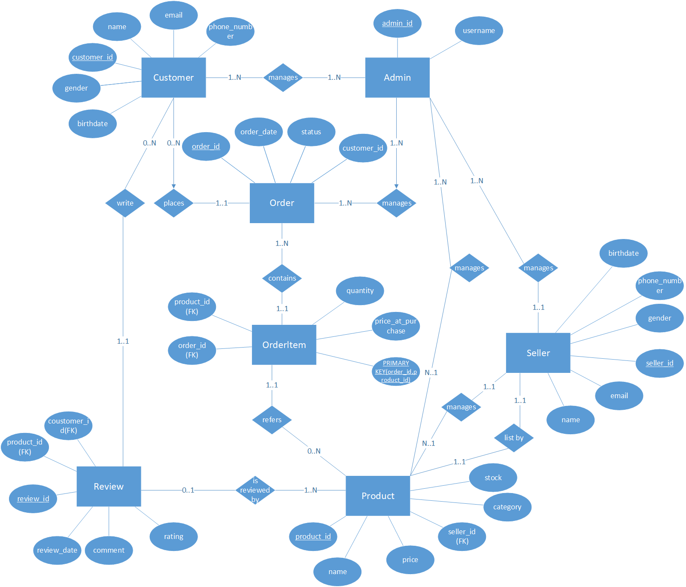 </div>

---

## 五、ER Diagram 詳細說明（實體與關係）

---

### 1. `Customer`（買家）

| 欄位名稱          | 資料型別         | 鍵類型 | 約束條件與驗證                    | 是否可為空 | 說明                 |
| ------------- | ------------ | --- | -------------------------- | ----- | ------------------ |
| customer\_id  | CHAR(10)     | 主鍵  | UNIQUE、NOT NULL            | 否     | 客戶編號，系統生成或手動指定     |
| name          | VARCHAR(20)  |     | `^[A-Za-z0-9]{3,20}$` 格式驗證 | 否     | 僅允許英文、數字，3\~20 字元  |
| email         | VARCHAR(100) | 唯一  | `UNIQUE`, Email 格式驗證       | 否     | 使用者唯一電子郵件帳號        |
| phone\_number | CHAR(10)     |     | `^09\d{8}$` 格式驗證           | 否     | 台灣手機格式（09 開頭）      |
| gender        | ENUM         |     | 限定值：「男」、「女」、「其他」           | 否     | 可用 ENUM 或 CHECK 約束 |
| birthdate     | DATE         |     | 不得晚於當前系統時間                 | 否     | 格式：DD/MM/YYYY      |

---

### 2. `Seller`（賣家）

| 欄位名稱          | 資料型別         | 鍵類型 | 約束條件與驗證                    | 是否可為空 | 說明            |
| ------------- | ------------ | --- | -------------------------- | ----- | ------------- |
| seller\_id    | CHAR(10)     | 主鍵  | UNIQUE、NOT NULL            | 否     | 賣家編號          |
| name          | VARCHAR(20)  |     | `^[A-Za-z0-9]{3,20}$` 格式驗證 | 否     | 僅允許英文、數字      |
| email         | VARCHAR(100) | 唯一  | `UNIQUE`, Email 格式驗證       | 否     | 賣家電子信箱        |
| phone\_number | CHAR(10)     |     | `^09\d{8}$` 格式驗證           | 否     | 台灣手機格式（09 開頭） |
| gender        | ENUM         |     | 限定值：「男」、「女」、「其他」           | 否     | 性別欄位          |
| birthdate     | DATE         |     | 不得晚於當前系統時間                 | 否     | 格式：DD/MM/YYYY |

---

### 3. `Admin`（管理員）

| 欄位名稱      | 資料型別        | 鍵類型 | 約束條件與驗證                    | 是否可為空 | 說明                |
| --------- | ----------- | --- | -------------------------- | ----- | ----------------- |
| admin\_id | CHAR(10)    | 主鍵  | UNIQUE、NOT NULL            | 否     | 管理員編號             |
| username  | VARCHAR(20) | 唯一  | `^[A-Za-z0-9]{3,20}$` 格式驗證 | 否     | 僅允許英文、數字，3\~20 字元 |

---

### 4. `Product`（商品）

| 欄位名稱        | 資料型別          | 鍵類型 | 約束條件與驗證                                   | 是否可為空 | 說明                    |
| ----------- | ------------- | --- | ----------------------------------------- | ----- | --------------------- |
| product\_id | CHAR(10)      | 主鍵  | UNIQUE、NOT NULL                           | 否     | 商品編號                  |
| name        | VARCHAR(50)   |     | NOT NULL                                  | 否     | 商品名稱                  |
| price       | DECIMAL(10,2) |     | > 0                                       | 否     | 必須大於 0，可含兩位小數         |
| stock       | INT           |     | >= 0                                      | 否     | 商品庫存數量，不得為負           |
| category    | VARCHAR(30)   |     | 可選欄位，若填寫應屬於預先定義類別集合                       | 是     | 如 electronics、books 等 |
| seller\_id  | CHAR(10)      | 外鍵  | FOREIGN KEY 參照 Seller.seller\_id，NOT NULL | 否     | 商品所屬賣家                |

---

### 5. `Order`（訂單）

| 欄位名稱         | 資料型別     | 鍵類型 | 約束條件與驗證                                       | 是否可為空 | 說明             |
| ------------ | -------- | --- | --------------------------------------------- | ----- | -------------- |
| order\_id    | CHAR(10) | 主鍵  | UNIQUE、NOT NULL                               | 否     | 訂單編號           |
| order\_date  | DATE     |     | 格式為 YYYY-MM-DD，不得晚於當前系統時間，亦不得早於系統啟用日          | 否     | 訂單日期           |
| status       | ENUM     |     | ENUM: 未付款、處理中、已出貨、已完成                         | 否     | 訂單狀態，限制於四種固定狀態 |
| customer\_id | CHAR(10) | 外鍵  | FOREIGN KEY 參照 Customer.customer\_id，NOT NULL | 否     | 所屬客戶           |

---

### 6. `OrderItem`（訂單項目）

| 欄位名稱                | 資料型別          | 鍵類型  | 約束條件與驗證                                     | 是否可為空 | 說明            |
| ------------------- | ------------- | ---- | ------------------------------------------- | ----- | ------------- |
| order\_id           | CHAR(10)      | 複合主鍵 | FOREIGN KEY 參照 Order.order\_id，NOT NULL     | 否     | 訂單編號          |
| product\_id         | CHAR(10)      | 複合主鍵 | FOREIGN KEY 參照 Product.product\_id，NOT NULL | 否     | 商品編號          |
| quantity            | INT           |      | >= 1，且不得超過商品目前庫存                            | 否     | 購買數量          |
| price\_at\_purchase | DECIMAL(10,2) |      | > 0                                         | 否     | 訂單當下商品價格，固定紀錄 |

---

### 7. `Review`（商品評價）

| 欄位名稱         | 資料型別     | 鍵類型 | 約束條件與驗證                                       | 是否可為空 | 說明        |
| ------------ | -------- | --- | --------------------------------------------- | ----- | --------- |
| review\_id   | CHAR(10) | 主鍵  | UNIQUE、NOT NULL                               | 否     | 評價編號      |
| product\_id  | CHAR(10) | 外鍵  | FOREIGN KEY 參照 Product.product\_id，NOT NULL   | 否     | 所評價的商品    |
| customer\_id | CHAR(10) | 外鍵  | FOREIGN KEY 參照 Customer.customer\_id，NOT NULL | 否     | 評價人（買家）   |
| rating       | INT      |     | CHECK (rating BETWEEN 1 AND 5)                | 否     | 評分範圍 1\~5 |
| comment      | TEXT     |     | 若填寫須為有效內容，不得為純空白或無意義字元                        | 是     | 可留評論，需具意義 |
| review\_date | DATE     |     | 格式為 YYYY-MM-DD，且不得早於該商品之訂單完成時間，不得晚於今日         | 否     | 評價時間      |


---
## 六、Schema2SQL
| <center> 下圖為資料庫綱要圖 </center> |
| --------- |
| <div align=center>  </div> |

### 1. Customer（買家）

| 欄位名稱           | 資料型別         | 說明           |
| -------------- | ------------ | ------------ |
| customer\_id   | INT (PK)     | 買家主鍵，自動編號    |
| name           | VARCHAR(100) | 買家姓名         |
| email          | VARCHAR(255) | 電子郵件，唯一值     |
| phone          | VARCHAR(20)  | 電話號碼         |
| birthdate | DATETIME     | 買家生日，不可為空。格式須為`YYYY-MM-DD`，必須為有效歷史日期，不得晚於系統當前日期。     |


#### SQL
```sql
CREATE TABLE Customer (
    customer_id INT PRIMARY KEY AUTO_INCREMENT,
    name VARCHAR(20) NOT NULL,
    email VARCHAR(255) UNIQUE NOT NULL,
    phone_number VARCHAR(10) NOT NULL,
    gender ENUM('男', '女', '其他') NOT NULL,
    birthdate DATE NOT NULL,
    CONSTRAINT chk_name_format CHECK (name REGEXP '^[A-Za-z0-9]{3,20}$'),
    CONSTRAINT chk_email_format CHECK (email REGEXP '^[\\w\\.-]+@[\\w\\.-]+\\.\\w{2,}$'),
    CONSTRAINT chk_phone_format CHECK (phone_number REGEXP '^09\\d{8}$')
);
```

#### 範例
```sql
INSERT INTO Customer (name, email, phone_number, gender, birthdate) VALUES
('Alice123', 'alice123@example.com', '0912345678', '女', '1990-05-10'),
('BobChen01', 'bobchen01@example.com', '0987654321', '男', '1985-12-01'),
('CathyWang9', 'cathyw9@example.com', '0911122233', '其他', '1992-07-23'),
('DavidLiu88', 'davidliu88@example.com', '0922334455', '男', '1988-03-14'),
('EmmaWu77', 'emmawu77@example.com', '0933445566', '女', '1995-10-30'),
('FrankHuang', 'frankh@example.com', '0944556677', '男', '1979-08-22'),
('GraceTsai1', 'gracetsai1@example.com', '0955667788', '女', '1983-01-18'),
('HenryYeh22', 'henryyeh22@example.com', '0966778899', '男', '1991-06-05'),
('IreneKuo3', 'irenekuo3@example.com', '0977889900', '女', '1996-11-11'),
('JackyHsu44', 'jackyhsu44@example.com', '0988990011', '男', '1980-07-27');
```

---

### 2. Seller（賣家）

| 欄位名稱           | 資料型別         | 完整性限制說明                                                                                       |
| -------------- | ------------ | --------------------------------------------------------------------------------------------- |
| `seller_id`    | INT (PK)     | 主鍵，唯一且不可為空。系統自動生成或由系統驗證唯一性。                                                                   |
| `name`         | VARCHAR(100)    | 僅可包含英文大小寫與數字（A-Z, a-z, 0-9），不得有空格或特殊字元，長度 3–20 字元。正規表示式：`^[A-Za-z0-9]{3,20}$`。                |
| `email`        | VARCHAR(255)     | 唯一且不可為空，需符合有效 Email 格式，例如 `user@example.com`，不可含空格。可使用正規表示式 `^[\w\.-]+@[\w\.-]+\.\w{2,}$` 驗證。 |
| `phone_number` | VARCHAR(20)     | 不可為空。必須為 10 位數字且開頭為 `09`。正規表示式：`^09\d{8}$`。                                                   |
| `gender`       | ENUM('男', '女', '其他') / VARCHAR(10)     | 不可為空。僅允許「男」、「女」、「其他」三種值。建議使用 ENUM 或 CHECK 限制。                                                 |
| `birthdate`    | DATE     | 賣家生日， 不可為空。格式須為`YYYY-MM-DD`，必須為有效歷史日期，不得晚於系統當前日期。                                                  |


#### SQL
```sql
CREATE TABLE Seller (
    seller_id INT PRIMARY KEY AUTO_INCREMENT,
    name VARCHAR(20) NOT NULL,
    email VARCHAR(255) UNIQUE NOT NULL,
    phone_number VARCHAR(10) NOT NULL,
    gender ENUM('男', '女', '其他') NOT NULL,
    birthdate DATE NOT NULL,
    CONSTRAINT chk_name_format_seller CHECK (name REGEXP '^[A-Za-z0-9]{3,20}$'),
    CONSTRAINT chk_email_format_seller CHECK (email REGEXP '^[\\w\\.-]+@[\\w\\.-]+\\.\\w{2,}$'),
    CONSTRAINT chk_phone_format_seller CHECK (phone_number REGEXP '^09\\d{8}$')
);

```

#### 範例
```sql
INSERT INTO Seller (name, email, phone_number, gender, birthdate) VALUES
('ShopA123', 'shopa123@example.com', '0912345678', '男', '1980-05-10'),
('ShopB456', 'shopb456@example.com', '0922334455', '女', '1985-12-01'),
('ShopC789', 'shopc789@example.com', '0933445566', '其他', '1990-07-23'),
('GadgetWorld', 'gadgetworld@example.com', '0944556677', '男', '1975-03-14'),
('BookHaven1', 'bookhaven1@example.com', '0955667788', '女', '1988-10-30'),
('FashionZone', 'fashionzone@example.com', '0966778899', '男', '1995-08-22'),
('TechHub123', 'techhub123@example.com', '0977889900', '女', '1992-01-18'),
('KitchenPro', 'kitchenpro@example.com', '0988990011', '其他', '1983-06-05'),
('ToyPlanetX', 'toyplanetx@example.com', '0911222333', '男', '1991-11-11'),
('GreenGarden', 'greengarden@example.com', '0922333444', '女', '1979-07-27');


```

---

### 3. Admin（管理員）

| 欄位名稱   | 資料型別       | 說明           |
|------------|----------------|----------------|
| admin_id   | INT (PK)       | 管理員主鍵，自動編號 |
| username   | VARCHAR(50)    | 使用者名稱，唯一 |

#### SQL
```sql
CREATE TABLE Admin (
    admin_id INT PRIMARY KEY AUTO_INCREMENT,
    username VARCHAR(20) NOT NULL UNIQUE,
    CONSTRAINT chk_username_format_admin CHECK (username REGEXP '^[A-Za-z0-9]{3,20}$')
);
```

#### 範例
```sql
INSERT INTO Admin (username) VALUES
('admin1'),
('admin2'),
('juliaadmin'),
('superadmin'),
('systemmgr'),
('useradmin'),
('johndoe'),
('susanadmin'),
('admintest'),
('webmaster');

```

---

### 4. Product（商品）

| 欄位名稱        | 資料型別          | 說明                                   |
| ----------- | ------------- | ------------------------------------ |
| product\_id | INT (PK)      | 商品主鍵，自動編號，唯一且不可為空                    |
| name        | VARCHAR(50)   | 商品名稱，不可為空，長度 3-50，允許中英文、數字及空格，禁止特殊符號 |
| price       | DECIMAL(10,2) | 商品價格，不可為空，必須大於 0，最多兩位小數              |
| stock       | INT           | 商品庫存數量，不可為空，整數且不可為負                  |
| category    | VARCHAR(50)   | 商品分類，可空，長度不超過 50，允許中英文、數字及空格         |
| seller\_id  | INT (FK)      | 賣家外鍵，連結 Seller.seller\_id，不可為空       |


#### SQL
```sql
CREATE TABLE Product (
    product_id INT PRIMARY KEY AUTO_INCREMENT,
    name VARCHAR(50) NOT NULL CHECK (name REGEXP '^[A-Za-z0-9 ]{3,50}$'),
    price DECIMAL(10, 2) NOT NULL CHECK (price > 0),
    stock INT NOT NULL CHECK (stock >= 0),
    category VARCHAR(50) CHECK (name REGEXP '^[A-Za-z0-9 ]{3,50}$'),
    seller_id INT NOT NULL,
    FOREIGN KEY (seller_id) REFERENCES Seller(seller_id)
);

```

#### 範例
```sql
INSERT INTO Product (name, price, stock, category, seller_id) VALUES
('Wireless Mouse', 599.00, 100, 'Electronics', 1),
('Bluetooth Keyboard', 899.00, 80, 'Electronics', 1),
('USBC Charger', 299.00, 150, 'Accessories', 2),
('Laptop Stand', 799.00, 50, 'Office', 3),
('Notebook', 59.00, 200, 'Stationery', 5),
('TShirt', 399.00, 120, 'Clothing', 6),
('Coffee Maker', 1299.00, 30, 'Kitchen', 8),
('Action Figure', 499.00, 75, 'Toys', 9),
('Garden Shovel', 199.00, 60, 'Garden', 10),
('LED Desk Lamp', 699.00, 40, 'Lighting', 4);


```

---

### 5. Order（訂單）

| 欄位名稱          | 資料型別     | 說明                                            |
| ------------- | -------- | --------------------------------------------- |
| `order_id`    | INT      | 主鍵，自動編號，唯一且不可為空                               |
| `order_date`  | DATETIME | 建立日期，不可為空，格式為 `YYYY-MM-DD HH:mm:ss`，預設為系統當前時間 |
| `status`      | ENUM     | 訂單狀態，不可為空，限定值：`未付款`、`處理中`、`已出貨`、`已完成`         |
| `customer_id` | INT      | 買家外鍵，不可為空，參照 `Customer.customer_id`           |


#### SQL
```sql
CREATE TABLE `Order` (
    order_id INT PRIMARY KEY AUTO_INCREMENT,
    order_date DATETIME NOT NULL DEFAULT CURRENT_TIMESTAMP,
    status ENUM('未付款', '處理中', '已出貨', '已完成') NOT NULL,
    customer_id INT NOT NULL,
    FOREIGN KEY (customer_id) REFERENCES Customer(customer_id)
);

```

#### 範例
```sql
INSERT INTO `Order` (status, customer_id) VALUES
('處理中', 1),
('已完成', 2),
('已出貨', 3),
('未付款', 4),
('處理中', 5),
('已完成', 6),
('已出貨', 7),
('處理中', 8),
('未付款', 9),
('處理中', 10);

```

---

### 6. OrderItem（訂單項目）

| 欄位名稱                | 資料型別          | 說明                                     |
| ------------------- | ------------- | -------------------------------------- |
| order\_id           | INT (PK, FK)  | 訂單編號，複合主鍵，不可為空，參照 `Order.order_id`     |
| product\_id         | INT (PK, FK)  | 商品編號，複合主鍵，不可為空，參照 `Product.product_id` |
| quantity            | INT           | 購買數量，不可為空，必須大於 0                       |
| price\_at\_purchase | DECIMAL(10,2) | 購買時的單價，不可為空，價格不得為負                     |


#### SQL
```sql
CREATE TABLE OrderItem (
    order_id INT,
    product_id INT,
    quantity INT NOT NULL,
    price_at_purchase DECIMAL(10, 2) NOT NULL,
    PRIMARY KEY (order_id, product_id),
    FOREIGN KEY (order_id) REFERENCES `Order`(order_id),
    FOREIGN KEY (product_id) REFERENCES Product(product_id)
);
```

#### 範例
```sql
INSERT INTO OrderItem (order_id, product_id, quantity, price_at_purchase) VALUES
(1, 1, 2, 599.00),
(1, 2, 1, 899.00),
(2, 3, 3, 299.00),
(3, 4, 1, 799.00),
(4, 5, 5, 59.00),
(5, 6, 2, 399.00),
(6, 7, 1, 1299.00),
(7, 8, 4, 499.00),
(8, 9, 2, 199.00),
(9, 10, 1, 699.00);

```

---

### 7. Review（商品評價）

| 欄位名稱         | 資料型別     | 說明                                  |
| ------------ | -------- | ----------------------------------- |
| review\_id   | INT (PK) | 評價主鍵，自動編號，不可為空                      |
| product\_id  | INT (FK) | 商品外鍵，不可為空，參照 `Product.product_id`   |
| customer\_id | INT (FK) | 買家外鍵，不可為空，參照 `Customer.customer_id` |
| rating       | INT      | 評分，不可為空，限制為 1 至 5 之間的整數             |
| comment      | TEXT     | 留言內容，可為空                            |
| review\_date | DATETIME | 評價時間，預設為目前時間，不可為空                   |


#### SQL
```sql
CREATE TABLE Review (
    review_id INT PRIMARY KEY AUTO_INCREMENT,
    product_id INT NOT NULL,
    customer_id INT NOT NULL,
    rating INT CHECK (rating BETWEEN 1 AND 5),
    comment TEXT,
    review_date DATETIME DEFAULT CURRENT_TIMESTAMP,
    FOREIGN KEY (product_id) REFERENCES Product(product_id),
    FOREIGN KEY (customer_id) REFERENCES Customer(customer_id)
);
```

#### 範例
```sql
INSERT INTO Review (product_id, customer_id, rating, comment) VALUES
(1, 1, 5, '非常好用，品質也很棒'),
(2, 2, 4, '打字手感不錯，就是有點重'),
(3, 3, 3, '充電頭普通，不過夠用'),
(4, 4, 5, '很穩定的支架，推薦'),
(5, 5, 4, '紙質不錯，適合書寫'),
(6, 6, 2, '材質一般，容易皺'),
(7, 7, 5, '煮咖啡很方便，滿意'),
(8, 8, 4, '小朋友很喜歡'),
(9, 9, 3, '有點小貴，但好用'),
(10, 10, 5, '燈光柔和，很適合夜讀');
```


---


## 七、實作結果
本專案以 MariaDB 作為資料庫管理系統，依據設計需求成功建構完整的資料表，並導入測試資料進行驗證。實作成果如下：

## 1. 資料表建立成功
共建置 7 張資料表，涵蓋使用者（買家、賣家、管理員）、商品、訂單、訂單項目與評價等主要資料實體。
每張表皆設定必要的 主鍵（PRIMARY KEY）、外鍵（FOREIGN KEY） 與 完整性限制（CHECK、UNIQUE、NOT NULL），以確保資料一致性與正確性。

| 資料表名稱       | 說明                  |
| ----------- | ------------------- |
| `Customer`  | 買家資料表，含個人資訊、驗證條件    |
| `Seller`    | 賣家資料表，與商品關聯         |
| `Admin`     | 管理員帳號資料，限制名稱格式      |
| `Product`   | 商品資訊，含價格、庫存、所屬賣家    |
| `Order`     | 訂單主檔，與買家關聯          |
| `OrderItem` | 訂單明細，每筆對應訂單與商品      |
| `Review`    | 商品評價，含評分、評論、顧客與商品資訊 |


## 2. 完整性限制應用成功
使用正規表示式（REGEXP）、CHECK、ENUM 等方式，針對如下欄位進行驗證：

| 欄位 | 完整性限制 |
| ------- | ----------------------- |
|姓名|限制為英文或數字，長度 3–20 字 |
|Email | 符合 email 格式，並保證唯一 |
|電話 | 必須為台灣手機號碼格式（如 09 開頭，共 10 碼）|
|出生日期 | 不可為未來時間 |
|商品價格與庫存 | 不得為負數或零 |
|評價分數 | 限定為 1–5 分 |

詳細請看 [三、完整性限制（Integrity Constraints）](https://github.com/jayforedu/DBMS-homework/tree/main?tab=readme-ov-file#%E4%B8%89%E5%AE%8C%E6%95%B4%E6%80%A7%E9%99%90%E5%88%B6integrity-constraints)

## 3. 範例資料成功插入
每張資料表均已導入 10 筆測試資料。

|  <center>下圖為買家之資料表</center> |
| ------- |
| <div align=center>  </div>  |
<br>

---

|  <center>下圖為賣家之資料表 </center> |
| ------- |
| <div align=center> 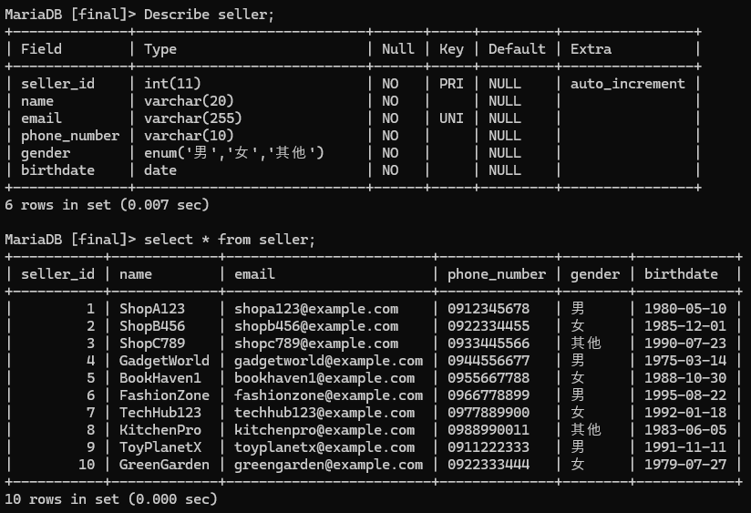 </div>  |
<br>

---

|  <center>下圖為管理員之資料表</center> |
| ------- |
| <div align=center> 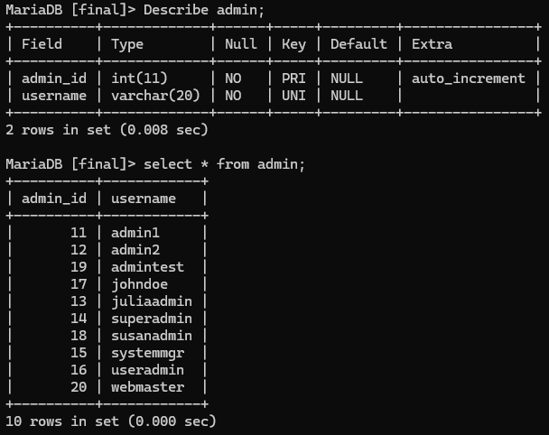 </div>  |
<br>

---

|  <center>下圖為商品之資料表</center> |
| ------- |
| <div align=center> 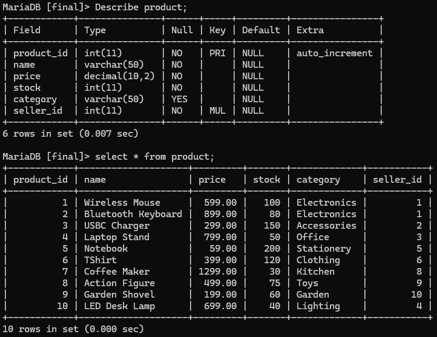 </div>  |
<br>

---

|  <center>下圖為訂單之資料表</center> |
| ------- |
| <div align=center> 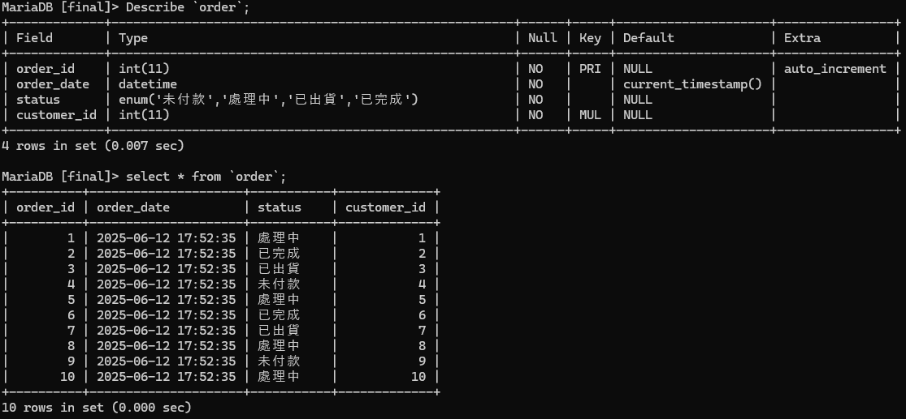 </div>  |
<br>

---

|  <center>下圖為訂單項目之資料表</center> |
| ------- |
| <div align=center> 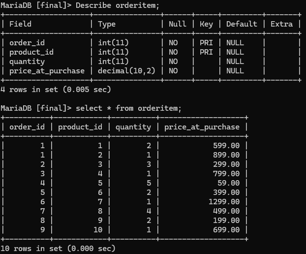 </div>  |
<br>

---

下圖為商品評價之資料表</center> |
| ------- |
| <div align=center> 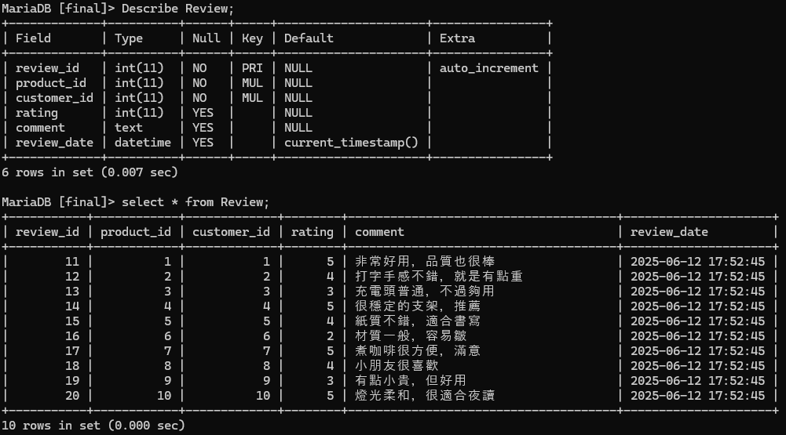 </div>  |
<br>

---

## 八、view實作

### CustomerPublicInfo View

顯示顧客基本資料:

```sql
CREATE VIEW CustomerPublicInfo AS
SELECT 
    customer_id,
    name
FROM Customer;
```

#### 範例

```sql
SELECT * FROM CustomerPublicInfo;
```

#### 結果範例

<div align=center> 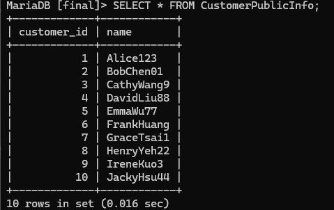 </div>
<br>

---

### SellerStats View

統計每位賣家商品數量與平均評價：

```sql
CREATE VIEW SellerStats AS
SELECT 
    s.seller_id,
    s.name AS seller_name,
    COUNT(p.product_id) AS total_products,
    ROUND(AVG(r.rating), 2) AS average_rating
FROM Seller s
LEFT JOIN Product p ON s.seller_id = p.seller_id
LEFT JOIN Review r ON p.product_id = r.product_id
GROUP BY s.seller_id, s.name;
```

#### 範例

```sql
SELECT * FROM SellerStats WHERE average_rating >= 4.5;
```

#### 結果範例

<div align=center> 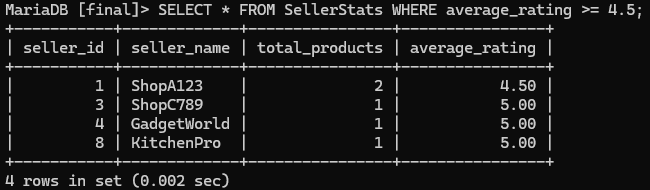 </div>
<br>


---

### HighPricedProducts View

列出目前庫存中之商品資訊：

```sql
CREATE VIEW HighPricedProducts AS
SELECT 
    product_id,
    name,
    price,
    stock,
    category,
    seller_id
FROM Product
WHERE stock > 0
ORDER BY price DESC;
```

#### 範例

```sql
SELECT * FROM HighPricedProducts LIMIT 2;
```

#### 結果範例

<div align=center> 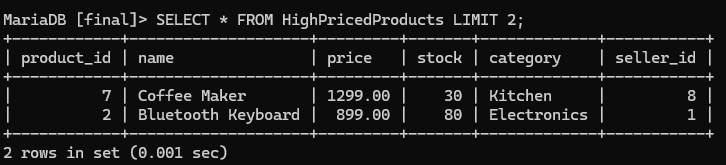 </div>
<br>


---

### OrderSummary View

呈現訂單基本資料與顧客資訊：

```sql
CREATE VIEW OrderSummary AS
SELECT 
    o.order_id,
    o.order_date,
    o.status,
    o.customer_id,
    c.name AS customer_name
FROM `Order` o
JOIN Customer c ON o.customer_id = c.customer_id;
```

#### 範例

```sql
SELECT * FROM OrderSummary WHERE status = '已出貨';
```

#### 結果範例

<div align=center> 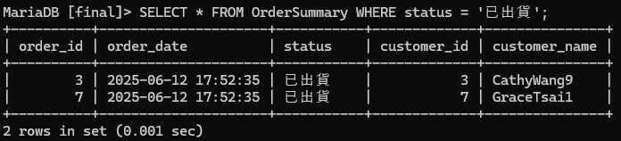 </div>
<br>

---

### OrderItemDetails View

查詢每筆訂單中商品詳細資訊：

```sql
CREATE VIEW OrderItemDetails AS
SELECT 
    oi.order_id,
    oi.product_id,
    p.name AS product_name,
    oi.quantity,
    oi.price_at_purchase
FROM OrderItem oi
JOIN Product p ON oi.product_id = p.product_id;
```

#### 範例

```sql
SELECT * FROM OrderItemDetails;
```

#### 結果範例

<div align=center> 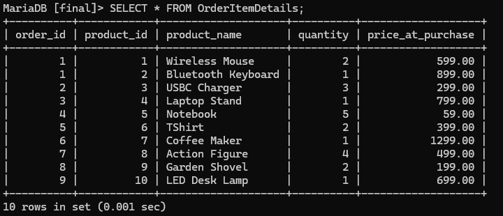 </div>
<br>

---

### ProductReviewStats View

呈現商品之平均評價與最近評價時間：

```sql
CREATE VIEW ProductReviewStats AS
SELECT 
    p.product_id,
    p.name AS product_name,
    ROUND(AVG(r.rating), 2) AS average_rating,
    MAX(r.review_date) AS latest_review_time
FROM Product p
JOIN Review r ON p.product_id = r.product_id
GROUP BY p.product_id, p.name;
```

#### 範例

```sql
SELECT * FROM ProductReviewStats;
```

#### 結果範例
<div align=center> 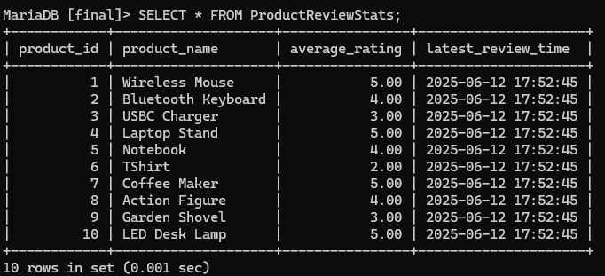 </div>
<br>


---

### LatestProductReview View

查詢每個商品的最新一筆評價：

```sql
CREATE VIEW LatestProductReview AS
SELECT r.*
FROM Review r
JOIN (
    SELECT product_id, MAX(review_date) AS latest_date
    FROM Review
    GROUP BY product_id
) latest ON r.product_id = latest.product_id AND r.review_date = latest.latest_date;
```

#### 範例

```sql
SELECT * FROM LatestProductReview;
```

#### 結果範例
<div align=center> 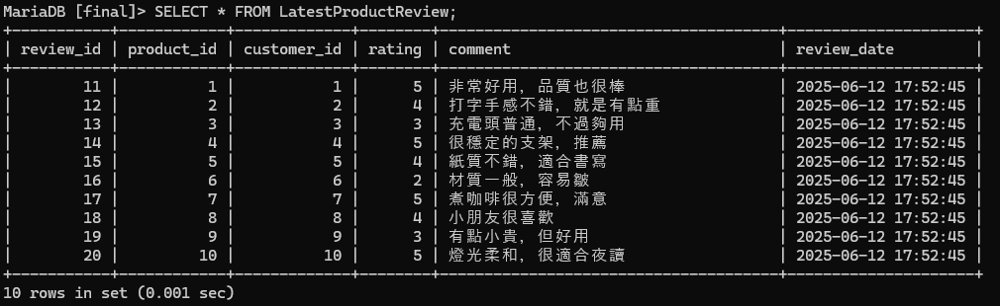 </div>
<br>

---

## 九、團隊分工
| 職位 | 姓名 | 分工項目 |
| ---- | ---- | --------- |
| 組長 | 曾聖傑 | 所有(舉凡Githube專案管理、撰寫README.md、所有組員做的內容、資料庫實作等) |
| 組員 | 陳立群 | 自我介紹、ER Diagram繪製、view實作 |
| 組員 | 蘇于驊 | 自我介紹、DB Schema繪製 |
| 組員 | 梁詠琳 | 自我介紹、系統需求、簡報及完整報告製作 |

---

## 十、參考資料
[MarkDown語法大全](https://hackmd.io/@mrcoding/ryZE7k8cN#H1)<br>
[Day 23 — 關聯式資料庫: 從設計講起](https://ithelp.ithome.com.tw/articles/10242588)
