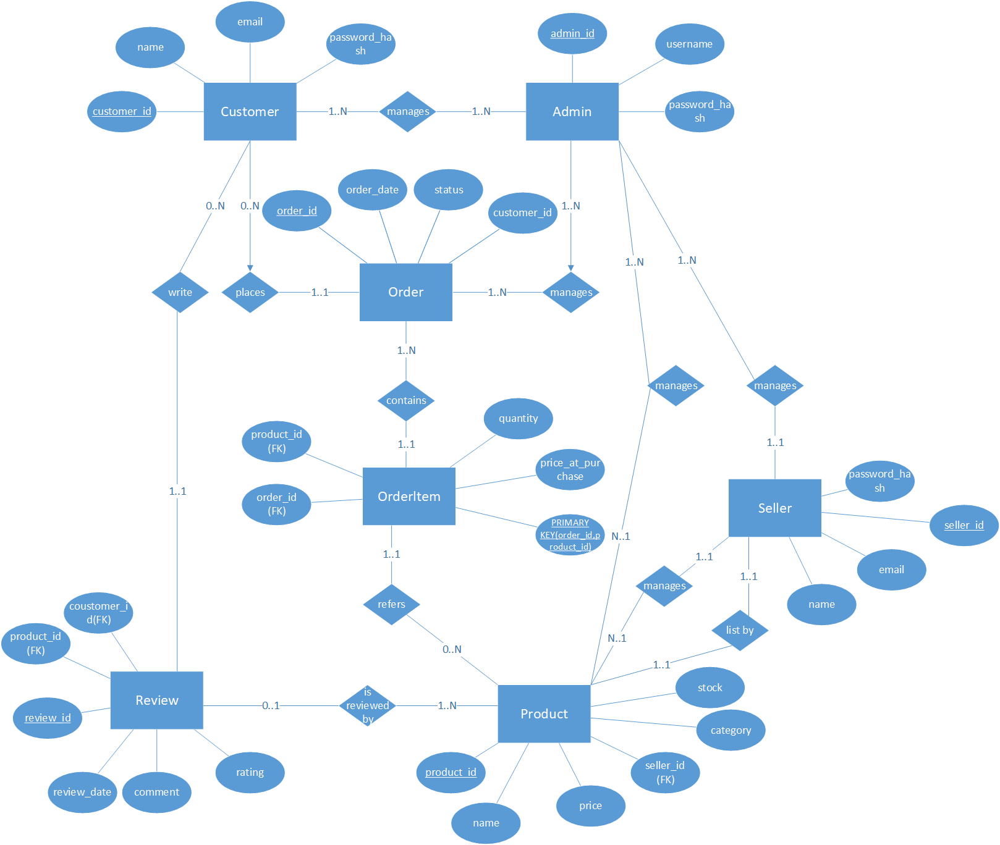

組員
===
41043218陳荔群、41043220曾聖傑、41043255蘇于驊、41048110梁詠琳 
===
# 題目: 電商平台資料庫設計

---

## 一、應用情境與使用案例（Use Case）

### 🔹 應用情境說明
本系統模擬一個電商平台（如蝦皮），讓賣家能夠上架商品、管理訂單，買家能夠註冊帳號、瀏覽商品、下訂單與付款，並提供評價功能。系統亦包含後台管理員可監控整體平台狀況。

### 🔹 使用者角色
- 買家（Customer）  
- 賣家（Seller）  
- 管理員（Admin）

### 🔹 主要使用案例 Use Cases

| 使用者角色 | 使用案例 |
|------------|-----------|
| 買家       | 註冊/登入、瀏覽商品、加入購物車、下單、付款、查看訂單、評價商品 |
| 賣家       | 註冊/登入、上架商品、修改商品資訊、查看訂單、出貨、查看評論 |
| 管理員     | 查看平台交易記錄、管理用戶帳號、下架不當商品 |

---

## 二、系統需求說明

### 🔹 功能性需求
1. 使用者需註冊帳號以使用系統功能。
2. 賣家可以上傳商品資料，包含名稱、價格、庫存、分類等資訊。
3. 買家可搜尋、瀏覽、下單與付款。
4. 系統須紀錄每筆訂單明細、付款狀態與物流狀態。
5. 買家可於訂單完成後針對商品評價。
6. 管理員可檢舉/審查商品與用戶。

---

## 三、完整性限制（Integrity Constraints）

1. **主鍵唯一性**：每筆商品、訂單、使用者皆有唯一 ID。
2. **外鍵約束**：
   - 商品屬於某賣家（`Product.seller_id -> Seller.id`）
   - 訂單屬於某買家（`Order.customer_id -> Customer.id`）
3. **庫存限制**：商品庫存數量不得為負。
4. **付款狀態驗證**：僅當付款成功後，訂單狀態才能從「未付款」轉為「處理中」。
5. **評價限制**：使用者只能針對已完成的訂單商品進行評價一次。
6. **Email 唯一性**：每個使用者帳號的 Email 必須唯一。

---

## 四、ER Diagram（實體關係圖）

  

---

## 五、ER Diagram 詳細說明（實體與關係）

### 1. `Customer`（買家）
- `customer_id (PK)`
- `name`
- `email (unique)`
- `password_hash`

### 2. `Seller`（賣家）
- `seller_id (PK)`
- `name`
- `email (unique)`
- `password_hash`

### 3. `Admin`（管理員）
- `admin_id (PK)`
- `username`
- `password_hash`

### 4. `Product`（商品）
- `product_id (PK)`
- `name`
- `price`
- `stock`
- `category`
- `seller_id (FK → Seller.seller_id)`

### 5. `Order`（訂單）
- `order_id (PK)`
- `order_date`
- `status`（未付款 / 處理中 / 已出貨 / 已完成）
- `customer_id (FK → Customer.customer_id)`

### 6. `OrderItem`（訂單項目）
- `order_id (FK → Order.order_id)`
- `product_id (FK → Product.product_id)`
- `quantity`
- `price_at_purchase`
- 複合主鍵：(`order_id`, `product_id`)

### 7. `Review`（商品評價）
- `review_id (PK)`
- `product_id (FK → Product.product_id)`
- `customer_id (FK → Customer.customer_id)`
- `rating (1-5)`
- `comment`
- `review_date`

---

