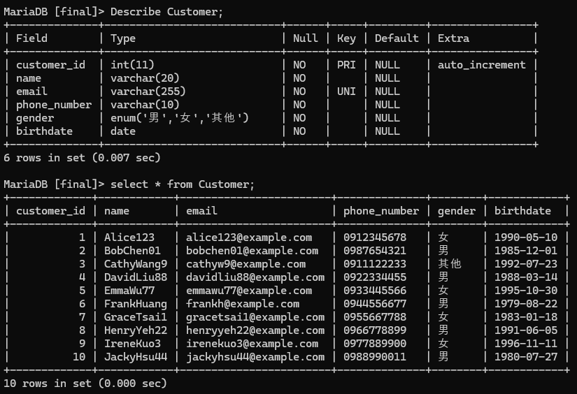
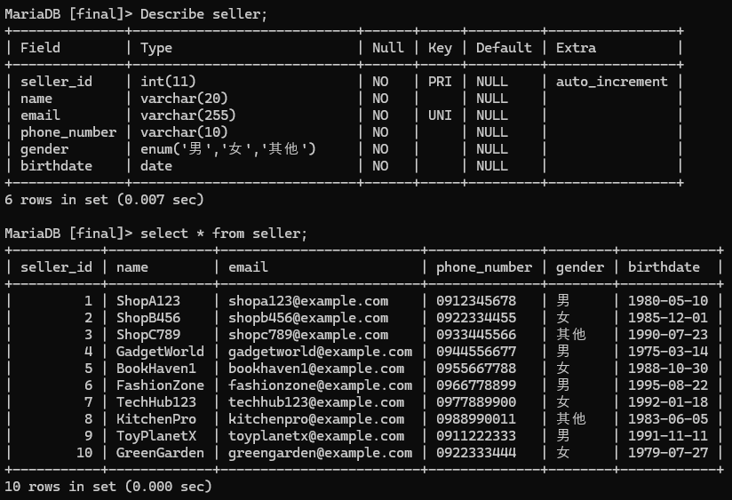
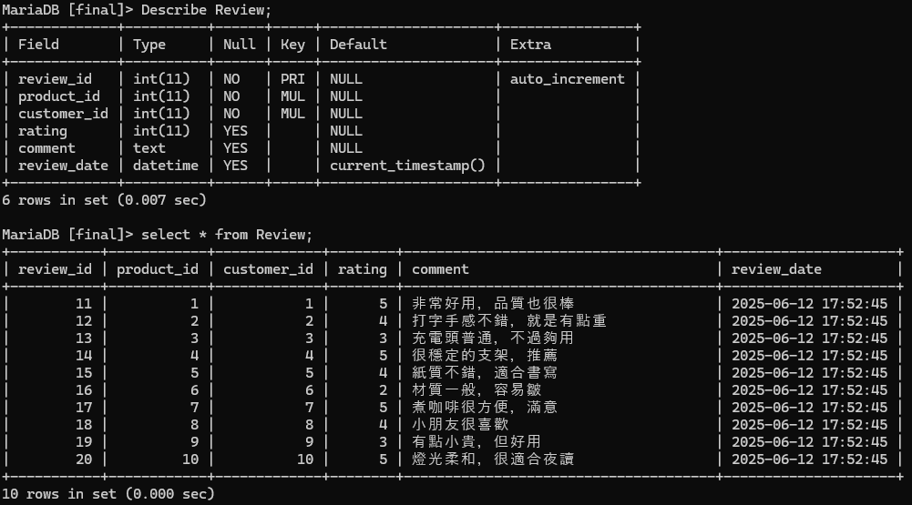

# 實作結果介紹（Implementation Results）
本專案以 MariaDB 作為資料庫管理系統，依據設計需求成功建構完整的資料表，並導入測試資料進行驗證。實作成果如下：

## 1. 資料表建立成功
共建置 7 張資料表，涵蓋使用者（買家、賣家、管理員）、商品、訂單、訂單項目與評價等主要資料實體。
每張表皆設定必要的 主鍵（PRIMARY KEY）、外鍵（FOREIGN KEY） 與 完整性限制（CHECK、UNIQUE、NOT NULL），以確保資料一致性與正確性。

| 資料表名稱       | 說明                  |
| ----------- | ------------------- |
| `Customer`  | 買家資料表，含個人資訊、驗證條件    |
| `Seller`    | 賣家資料表，與商品關聯         |
| `Admin`     | 管理員帳號資料，限制名稱格式      |
| `Product`   | 商品資訊，含價格、庫存、所屬賣家    |
| `Order`     | 訂單主檔，與買家關聯          |
| `OrderItem` | 訂單明細，每筆對應訂單與商品      |
| `Review`    | 商品評價，含評分、評論、顧客與商品資訊 |

## 2. 完整性限制應用成功
使用正規表示式（REGEXP）、CHECK、ENUM 等方式，針對如下欄位進行驗證：

| 欄位 | 完整性限制 |
| ------- | ----------------------- |
|姓名|限制為英文或數字，長度 3–20 字 |
|Email | 符合 email 格式，並保證唯一 |
|電話 | 必須為台灣手機號碼格式（如 09 開頭，共 10 碼）|
|出生日期 | 不可為未來時間 |
|商品價格與庫存 | 不得為負數或零 |
|評價分數 | 限定為 1–5 分 |

詳細請看 [三、完整性限制（Integrity Constraints）](https://github.com/jayforedu/DBMS-homework/tree/main?tab=readme-ov-file#%E4%B8%89%E5%AE%8C%E6%95%B4%E6%80%A7%E9%99%90%E5%88%B6integrity-constraints)

## 3. 範例資料成功插入
每張資料表均已導入 10 筆測試資料。

下圖為買家之資料表

  

 

下圖為賣家之資料表

  

 

下圖為管理員之資料表

  

 

下圖為商品之資料表

  

 

下圖為訂單之資料表

  

 

下圖為訂單項目之資料表

  

 

下圖為商品評價之資料表

  

 

